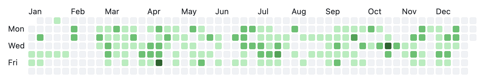

### Hi, I'm Benjamin

I'm a software engineer with eight years of experience building distributed systems, cloud infrastructure, and large-scale data pipelines for autonomous vehicle and backend applications.

I’m currently the software development lead for the team behind the map update API powering Super Cruise, GM’s hands-free driving system, and the primary data source for over 200,000 vehicles.

Because most of my work lives in private repositories, my public profile does not reflect the full scope of my contributions. Below is a snapshot of my activity from 2024:

---

### Technologies and Tools

**Languages:** Python, C++, Go  
**Backend:** FastAPI, gRPC  
**Cloud Platforms:** Azure (AKS, ADLS, Cosmos DB, Key Vault), GCP (GKE, GCS, Pub/Sub, Cloud SQL)  
**Data and Compute:** Spark, Databricks, Ray/RLlib, GPU-accelerated compute  
**Infrastructure:** Docker, Kubernetes, Helm, Terraform, CI/CD (GitHub Actions, Jenkins)  
**Monitoring and Networking:** Grafana, Azure Monitor, NSGs, VPCs, Private Endpoints  
**Other:** ROS, Linux, Git

---

### Selected Achievements

- Led CI/CD and backend infrastructure for over-the-air systems, managing a 10–12 person engineering team deploying to AKS and GKE.
- Built a ten-stage parallel ETL pipeline for autonomous map data, improving processing performance by 50×.
- Won first place in the [Melting Pot Challenge (AICrowd)](https://www.aicrowd.com/challenges/meltingpot-challenge-2023), part of [NeurIPS 2023](https://neurips.cc/virtual/2023/competition/66585) and hosted by Google DeepMind and MIT, by training multi-agent reinforcement learning models on GPU infrastructure as a solo participant.

---

📫 **Contact:**  
[LinkedIn](https://linkedin.com/in/ben-swe) · [Email](mailto:swainben1@gmail.com)
